# CCI-SIO21-Portfolio - Charte graphique

## *[AVANT-PROPOS](#Avant-propos)*
## *[OUTILS](#Outils-de-design)*
## *[LE-SITE](#Site)*
## *[CREDITS](#Special-credits)*

---

# **Avant-propos**
Ce document contient le référentiel de mon portfolio sur les images utilisés, les polices, et sur comment naviguer dans le site.  
Ce site a été conçu par moi-même, sans framework, juste du code avec trois languages dont HTML, CSS, et du JS pour quelques propriétés.  
Mon portfolio est actuellement hébergé chez le domaine de mon camarade de promotion à CCI Campus, Mr. Alexis Henry.

---

# **Outils de design**
## Design page index

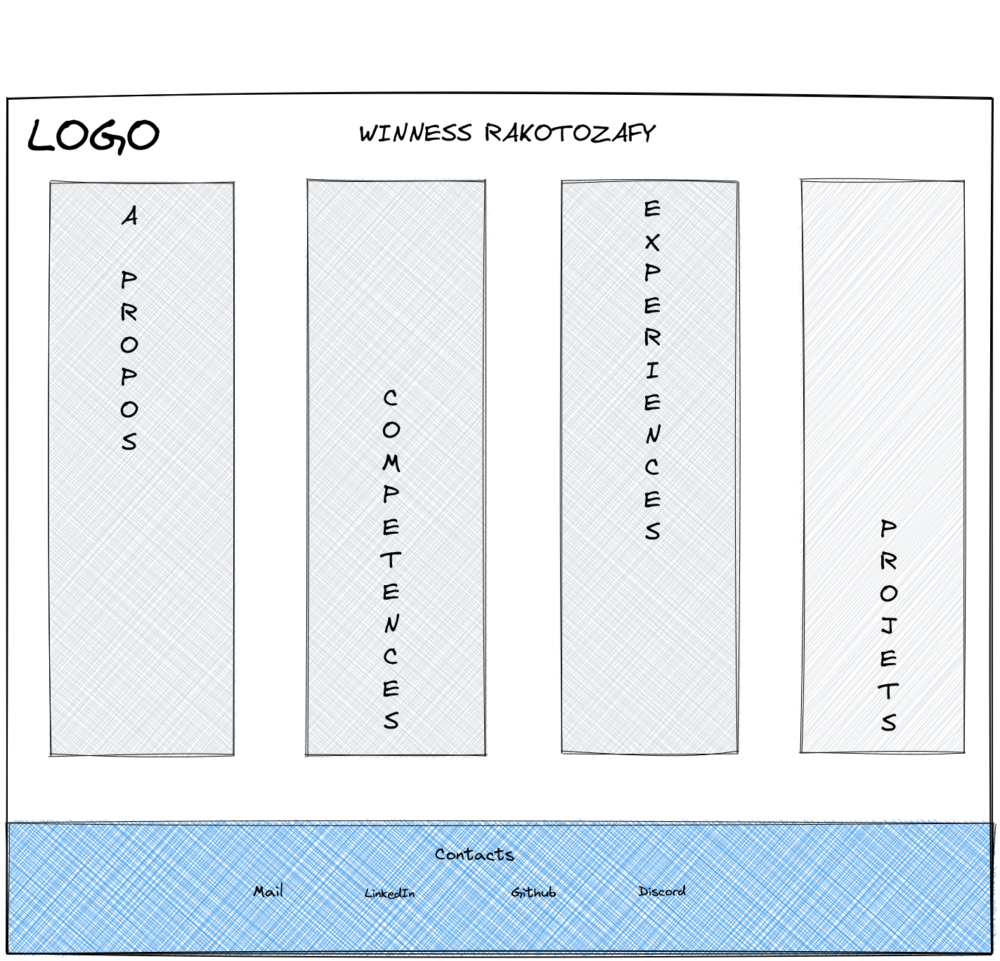

## Palette de couleurs
### Principaux couleurs utilisés

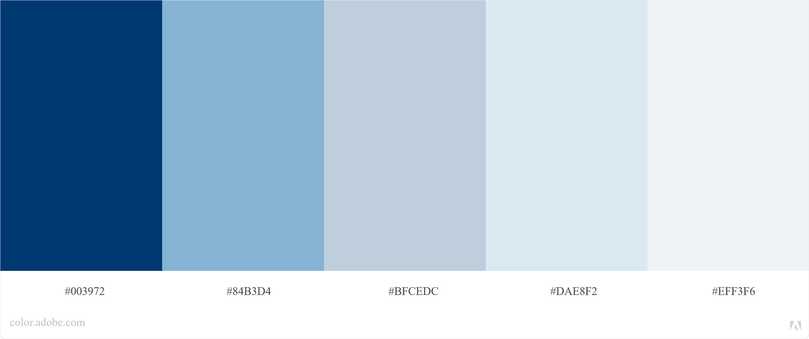

### Couleur du background `(#f5f5f5)` et police `(#343434)`

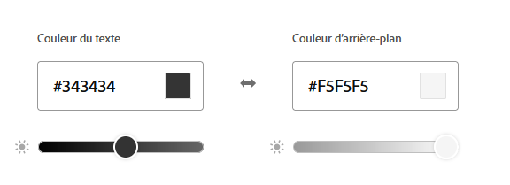

## Police utilisé (font-style)

`Press Start 2P` of Google Fonts
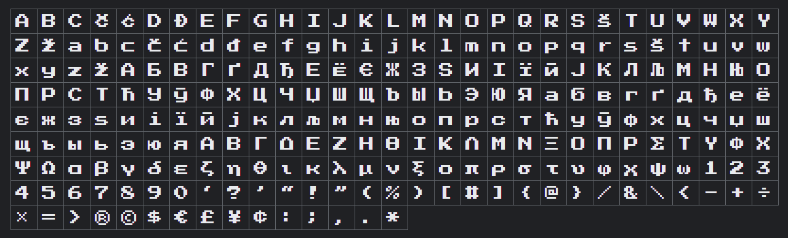

## Favicon utilisé
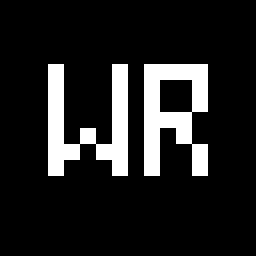

---

# **Site**
## Conception header
### For index:
#### <ins>Caractéristiques</ins>
Logo à gauche                 |                   Image à droite
:----------------------------:|:--------------------------------:
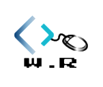 | 

=> **Nom + bienvenue sur mon portfolio au milieu des images**
#### <ins>Visual sample</ins>
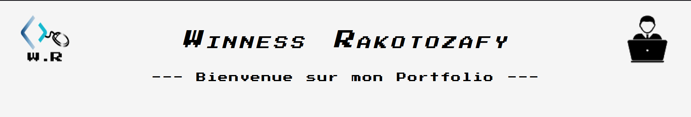
### For pages annexes:
#### <ins>Caractéristiques</ins>
Deux boutons:
* Un bouton ``MENU`` en haut à gauche en lien vers d'autres pages dont:
    - **A propos** =>  Présentation + Parcours + Passion.
    - **Compétences** => Mes principales compétences
    - **Expériences** => Une page énumérant mes expériences professionnelles et link vers mon CV.
    - **Projets** => Les différents projets que j'ai réalisés en entreprise.
* Un bouton ``ACCUEIL`` qui nous ramène vers la page index  
Quand on clique sur ``MENU``, le menu se scroll de haut en bas avec un `background #000000`

#### <ins>Visual sample</ins>
##### ***Header menu***
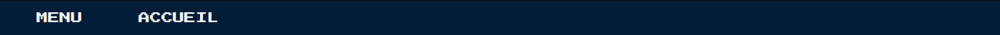
##### ***Menu opened***
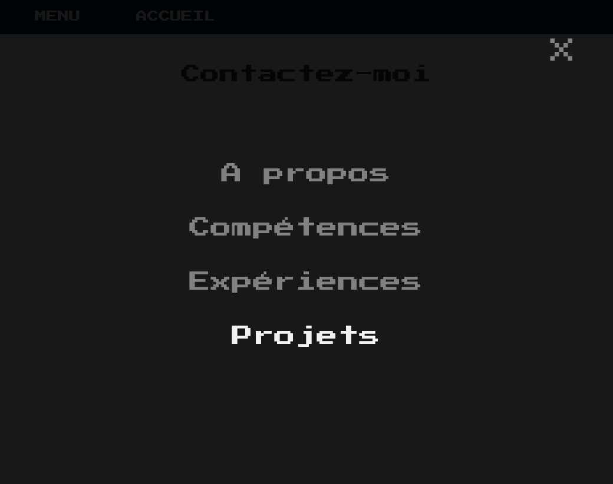

    
## Conception du Menu en index
### Description
* Menus rectangulaires défilantes de gauche à droite qui s'agrandira lorsque la souris sera sur le menu en question (propriétés CSS :hover)

* Lorsque le menu sera sélectionné par la souris, il s'agrandira au fur et à mesure avec une image de fond représentant la thématique du menu => exemple sur à propos, une photo de moi ; de même sur projets qui représentera les différents projets que j'ai entamé en IT.

* En plus de tout cela, à chaque menu, il y aura une image qui définira le menu en question 

### Visual sample
Before                       |                   After
:---------------------------:|:-----------------------:
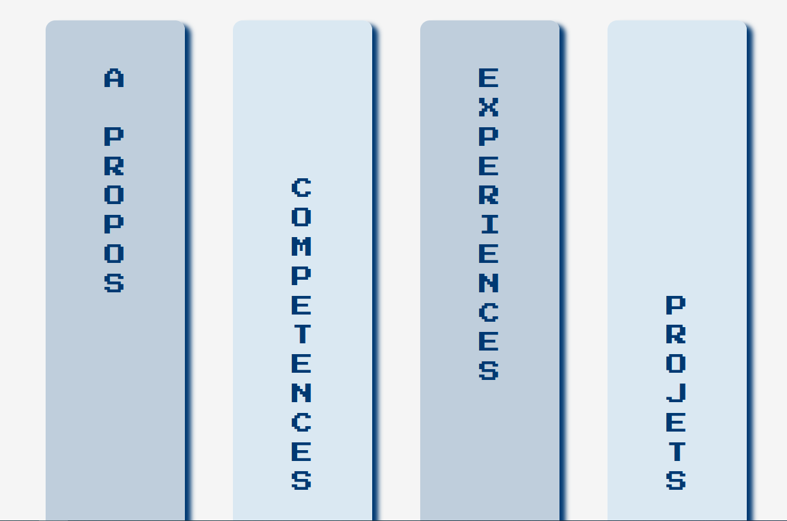 | 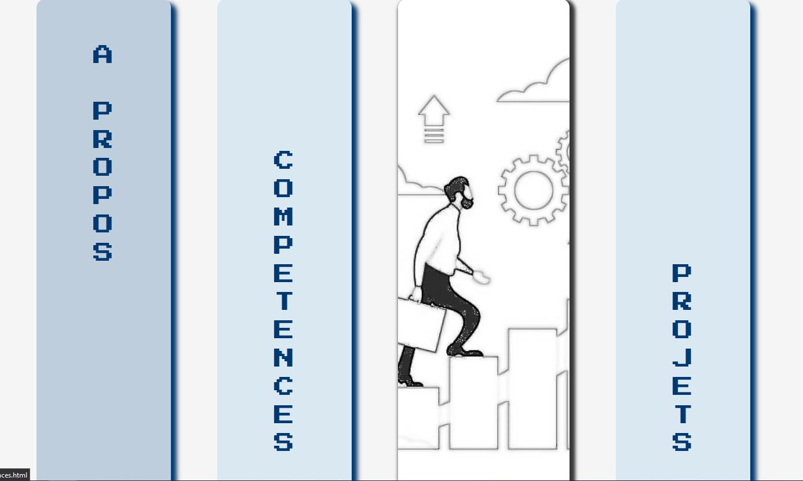

### Images utilisés en :hover
| A propos | Compétences | Exépriences | Projets |
|:-:|:-:|:-:|:-:|
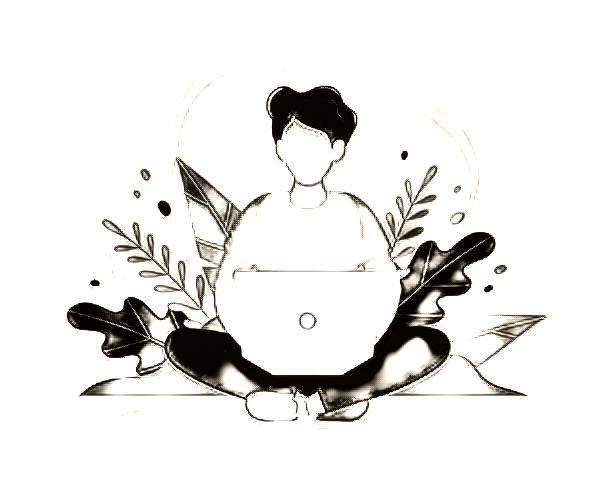 | 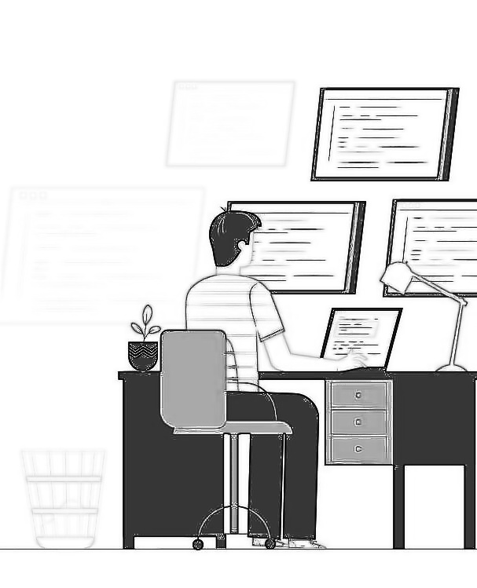 |  | 

## Conception footer
### Description
* Dans la barre **Contacts**, mettre une icone pour chaque type de contacts:  
#### <ins>Logos utilisés</ins>
|   Mail    |    LinkedIn    |    Github    |    Discord    |
|:-:|:-:|:-:|:-:|
| 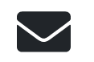 |  | 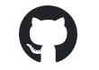 |  |

  
Ces logos seront importés via **[Fontawesome](https://fontawesome.com/)**
  
Pour naviguer vers ces réseaux-sociaux, les logos sont cliquables pour vous rediriger vers mon profil. Seul l'icone d'enveloppe pour Mail vous redirigera vers un formulaire de contact personnalisé.
  
* **Mentions légales** qui comprendra que mon nom et prénom (minimum obligatoires pour un site à usage personnel) en format:  
© 2022 Winness Rakotozafy - All rights reserved

### Visual sample
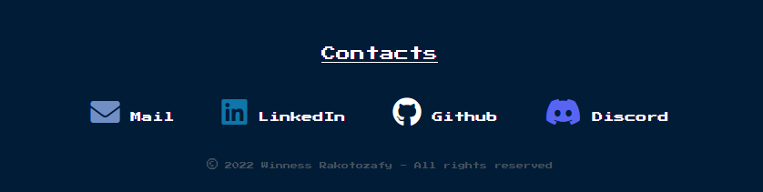

---

# **Special credits**